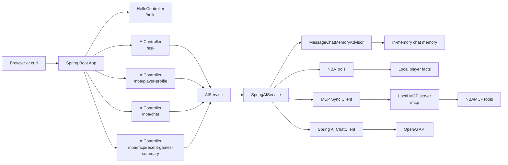

# Spring AI Starter

A concise starter project for building a Spring Boot application with Spring AI and OpenAI.

It includes:

- a basic REST endpoint at `/hello`
- an AI-powered endpoint at `/ask`
- an NBA structured-output endpoint at `/nba/player-profile`
- an NBA chat endpoint with conversation memory at `/nba/chat`
- an MCP-backed recent-games endpoint at `/nba/mcp/recent-games-summary`
- a local MCP server endpoint at `/mcp`
- a small browser UI served from the app itself
- example tests for the controllers

## Showcase Features

This project currently highlights five Spring AI features in a simple, demo-friendly way:

- `Guided chat responses` through `/ask`
- `Structured output` through `/nba/player-profile`
- `Conversation memory` through `/nba/chat`
- `Tool calling` through `/nba/chat` and `NBATools`
- `MCP server + client integration` through `/mcp`, `NBAMCPTools`, and `/nba/mcp/recent-games-summary`

The NBA chat flow now also demonstrates `tool calling` by letting Spring AI use a local Java tool for stable NBA player facts.
The MCP flow demonstrates a different pattern: the app exposes a local MCP server, then calls that server back through an MCP client to fetch recent-game data before summarizing it.

## What Is Spring AI?

Spring AI is a Spring ecosystem project that helps Java developers add AI capabilities to Spring applications using familiar patterns such as dependency injection, configuration properties, and service-oriented design.

Instead of wiring low-level model API calls by hand, you can use Spring-style abstractions to send prompts, receive responses, and integrate AI features into the rest of your application more cleanly.

## Benefits of Spring AI

- It fits naturally into Spring Boot applications and conventions.
- It reduces boilerplate when calling AI models.
- It keeps configuration manageable through standard Spring properties and environment variables.
- It makes it easier to swap or extend model integrations as your app grows.
- It lets you build AI-backed features without leaving the Spring programming model you already know.

## Tech Stack

- Java 25
- Spring Boot 3.5
- Spring AI 1.1
- Maven
- OpenAI via `spring-ai-starter-model-openai`

## What the App Does

### `GET /hello`

Returns a plain text greeting:

```text
Hello, world!
```

### `GET /ask`

Accepts a `message` query parameter and sends it to the configured OpenAI chat model through Spring AI.
This endpoint uses a guided system prompt so responses stay focused on Java, Spring Boot, and Spring AI topics.

Example:

```bash
curl "http://localhost:8080/ask?message=Tell%20me%20a%20short%20joke%20about%20Java"
```

If AI is not configured, the app returns a helpful setup message instead of failing hard.

### `GET /nba/player-profile`

Demonstrates structured output with an NBA use case. The app asks the model for a player profile and maps the response directly into a Java record.

Example:

```bash
curl "http://localhost:8080/nba/player-profile?playerName=Stephen%20Curry"
```

Example JSON response:

```json
{
  "playerName": "Stephen Curry",
  "team": "Golden State Warriors",
  "position": "Point Guard",
  "strengths": ["3-point shooting", "off-ball movement", "ball handling"],
  "playingStyle": "Elite perimeter creator who bends defenses with movement and range.",
  "summary": "One of the most influential offensive players in NBA history."
}
```

### `GET /nba/chat`

Demonstrates Spring AI chat memory with an NBA-focused conversation. Pass the same `conversationId` across requests and the assistant can use earlier messages as context for follow-up questions.
This flow also has access to a small local NBA tool for quick player facts, which makes it a simple example of Spring AI tool calling.

Examples:

```bash
curl "http://localhost:8080/nba/chat?conversationId=warriors-thread&message=Tell%20me%20about%20Stephen%20Curry"
```

```bash
curl "http://localhost:8080/nba/chat?conversationId=warriors-thread&message=What%20are%20his%20biggest%20strengths%3F"
```

```bash
curl "http://localhost:8080/nba/chat?conversationId=warriors-thread&message=Use%20the%20tool%20and%20give%20me%20quick%20facts%20about%20LeBron%20James"
```

Example JSON response:

```json
{
  "conversationId": "warriors-thread",
  "answer": "Stephen Curry is widely regarded as one of the greatest shooters in NBA history..."
}
```

### `GET /nba/mcp/recent-games-summary`

Demonstrates local MCP integration with an NBA-focused use case. The app calls its own local MCP server, runs the `get_recent_games_summary` tool through an MCP client, and then returns a typed JSON response with both the MCP data and a short summary.

Example:

```bash
curl "http://localhost:8080/nba/mcp/recent-games-summary?playerName=Stephen%20Curry"
```

Example JSON response:

```json
{
  "playerName": "Stephen Curry",
  "source": "local-mcp-server",
  "toolName": "get_recent_games_summary",
  "recentGames": [
    "2026-04-17 vs Lakers: 31 points, 5 rebounds, 8 assists in a 118-109 win.",
    "2026-04-14 vs Clippers: 27 points, 4 rebounds, 6 assists in a 111-115 loss.",
    "2026-04-11 vs Suns: 36 points, 6 rebounds, 7 assists in a 122-116 win."
  ],
  "summary": "Stephen Curry has been scoring at a high level while continuing to create offense for others."
}
```

### `POST /mcp` and `GET /mcp`

The application also exposes a local MCP server at `/mcp` using Spring AI's streamable HTTP server support.

This server currently exposes two demo tools:

- `get_recent_games_summary`
- `list_supported_players`

### Browser UI

Open:

```text
http://localhost:8080
```

The home page provides a lightweight interface for trying the app in the browser.

## Getting Started

### Prerequisites

- Java 25
- Maven 3.9+
- An OpenAI API key if you want to use `/ask`

### Run Locally

```bash
mvn spring-boot:run
```

Once the app starts, try:

- `http://localhost:8080`
- `http://localhost:8080/hello`
- `http://localhost:8080/ask?message=What%20is%20Spring%20AI`
- `http://localhost:8080/nba/player-profile?playerName=Stephen%20Curry`
- `http://localhost:8080/nba/chat?conversationId=warriors-thread&message=Tell%20me%20about%20Stephen%20Curry`
- `http://localhost:8080/nba/mcp/recent-games-summary?playerName=Stephen%20Curry`

## AI Configuration

Set these environment variables before starting the app:

```bash
export SPRING_AI_MODEL_CHAT=openai
export OPENAI_API_KEY=your_api_key_here
```

The application reads them from:

```properties
spring.ai.model.chat=${SPRING_AI_MODEL_CHAT:none}
spring.ai.openai.api-key=${OPENAI_API_KEY:}
```

If `SPRING_AI_MODEL_CHAT` is not set to `openai`, or if `OPENAI_API_KEY` is missing, the AI-backed endpoints return a friendly configuration message instead of failing hard.

## Run Tests

```bash
mvn test
```

## Quick Demo Flow

If you want to showcase the new AI features quickly, try these in order:

### 1. Guided Spring AI response

```bash
curl "http://localhost:8080/ask?message=What%20is%20Spring%20AI"
```

### 2. Structured NBA player profile

```bash
curl "http://localhost:8080/nba/player-profile?playerName=Stephen%20Curry"
```

### 3. Multi-turn NBA conversation with memory

```bash
curl "http://localhost:8080/nba/chat?conversationId=warriors-thread&message=Tell%20me%20about%20Stephen%20Curry"
curl "http://localhost:8080/nba/chat?conversationId=warriors-thread&message=What%20are%20his%20biggest%20strengths%3F"
```

The second NBA chat request reuses the same `conversationId`, so Spring AI can keep the conversation context in memory.

### 4. NBA tool calling

```bash
curl "http://localhost:8080/nba/chat?conversationId=tool-demo&message=Use%20the%20tool%20and%20give%20me%20quick%20facts%20about%20Nikola%20Jokic"
```

### 5. MCP-backed recent games summary

```bash
curl "http://localhost:8080/nba/mcp/recent-games-summary?playerName=Stephen%20Curry"
```

This route demonstrates a local MCP server and client working together: the app fetches recent-game data through MCP first, then summarizes it into a clean JSON response.

## Project Structure

```text
src/main/java/com/example/helloworld/
├── AIController.java
├── AIService.java
├── HelloController.java
├── HelloWorldApplication.java
├── NBAChatResponse.java
├── NBAMCPRecentGamesResponse.java
├── NBAMCPTools.java
├── NBAPlayerProfile.java
├── McpServerConfiguration.java
├── NBATools.java
└── SpringAIService.java
```

## Architecture Overview



The `/hello` request is handled directly by the app, while `/ask`, `/nba/player-profile`, `/nba/chat`, and `/nba/mcp/recent-games-summary` flow through the service layer. The NBA chat endpoint stores short conversation history in memory and can call a local NBA tool for stable player facts. The MCP endpoint shows a separate path where the app talks to its own local MCP server over the MCP protocol before summarizing the returned data.

## How It Works

- `HelloController` serves the `/hello` endpoint.
- `AIController` accepts user prompts through `/ask`.
- `AIController` also exposes `/nba/player-profile` for the structured-output demo.
- `AIController` exposes `/nba/chat` for the memory-based NBA conversation demo.
- `AIController` exposes `/nba/mcp/recent-games-summary` for the MCP demo.
- `AIService` defines the abstraction for AI responses.
- `SpringAIService` checks configuration, applies guided prompts, and uses Spring AI's `ChatClient` to call OpenAI.
- `MessageChatMemoryAdvisor` stores recent NBA conversation context by `conversationId`.
- `NBATools` exposes a small Java tool so the NBA chat flow can demonstrate Spring AI tool calling.
- `NBAMCPTools` exposes MCP tools through Spring AI's MCP server starter.
- `McpServerConfiguration` registers the local MCP tools with the MCP server.
- `NBAMCPRecentGamesResponse` keeps the MCP endpoint response aligned with the other typed API responses in the app.
- `NBAChatResponse` returns the conversation ID and the assistant reply for the chat-memory endpoint.
- `NBAPlayerProfile` is a Java record used to demonstrate structured output mapping.
- `src/main/resources/static/index.html` provides the built-in landing page.

## Example Requests

```bash
curl http://localhost:8080/hello
```

```bash
curl "http://localhost:8080/ask?message=Explain%20dependency%20injection%20in%20one%20sentence"
```

```bash
curl "http://localhost:8080/nba/player-profile?playerName=Stephen%20Curry"
```

```bash
curl "http://localhost:8080/nba/chat?conversationId=warriors-thread&message=Tell%20me%20about%20Stephen%20Curry"
```

```bash
curl "http://localhost:8080/nba/chat?conversationId=warriors-thread&message=What%20are%20his%20biggest%20strengths%3F"
```

```bash
curl "http://localhost:8080/nba/chat?conversationId=tool-demo&message=Use%20the%20tool%20and%20give%20me%20quick%20facts%20about%20LeBron%20James"
```

## Why This Project Is Useful

This repo is a good starting point if you want to:

- learn the basics of Spring Boot REST controllers
- see a minimal Spring AI integration
- experiment with OpenAI from a Java application
- build on top of a small, understandable starter codebase
