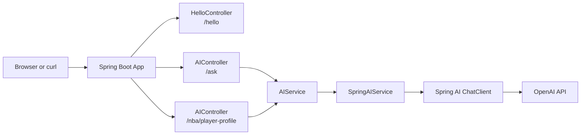

# Spring AI Starter

A concise starter project for building a Spring Boot application with Spring AI and OpenAI.

It includes:

- a basic REST endpoint at `/hello`
- an AI-powered endpoint at `/ask`
- a small browser UI served from the app itself
- example tests for the controllers

## What Is Spring AI?

Spring AI is a Spring ecosystem project that helps Java developers add AI capabilities to Spring applications using familiar patterns such as dependency injection, configuration properties, and service-oriented design.

Instead of wiring low-level model API calls by hand, you can use Spring-style abstractions to send prompts, receive responses, and integrate AI features into the rest of your application more cleanly.

## Benefits of Spring AI

- It fits naturally into Spring Boot applications and conventions.
- It reduces boilerplate when calling AI models.
- It keeps configuration manageable through standard Spring properties and environment variables.
- It makes it easier to swap or extend model integrations as your app grows.
- It lets you build AI-backed features without leaving the Spring programming model you already know.

## Tech Stack

- Java 25
- Spring Boot 3.5
- Spring AI 1.1
- Maven
- OpenAI via `spring-ai-starter-model-openai`

## What the App Does

### `GET /hello`

Returns a plain text greeting:

```text
Hello, world!
```

### `GET /ask`

Accepts a `message` query parameter and sends it to the configured OpenAI chat model through Spring AI.

Example:

```bash
curl "http://localhost:8080/ask?message=Tell%20me%20a%20short%20joke%20about%20Java"
```

If AI is not configured, the app returns a helpful setup message instead of failing hard.

### `GET /nba/player-profile`

Demonstrates structured output with an NBA use case. The app asks the model for a player profile and maps the response directly into a Java record.

Example:

```bash
curl "http://localhost:8080/nba/player-profile?playerName=Stephen%20Curry"
```

Example JSON response:

```json
{
  "playerName": "Stephen Curry",
  "team": "Golden State Warriors",
  "position": "Point Guard",
  "strengths": ["3-point shooting", "off-ball movement", "ball handling"],
  "playingStyle": "Elite perimeter creator who bends defenses with movement and range.",
  "summary": "One of the most influential offensive players in NBA history."
}
```

### Browser UI

Open:

```text
http://localhost:8080
```

The home page provides a lightweight interface for trying the app in the browser.

## Getting Started

### Prerequisites

- Java 25
- Maven 3.9+
- An OpenAI API key if you want to use `/ask`

### Run Locally

```bash
mvn spring-boot:run
```

Once the app starts, try:

- `http://localhost:8080`
- `http://localhost:8080/hello`
- `http://localhost:8080/ask?message=What%20is%20Spring%20AI`
- `http://localhost:8080/nba/player-profile?playerName=Stephen%20Curry`

## AI Configuration

Set these environment variables before starting the app:

```bash
export SPRING_AI_MODEL_CHAT=openai
export OPENAI_API_KEY=your_api_key_here
```

The application reads them from:

```properties
spring.ai.model.chat=${SPRING_AI_MODEL_CHAT:none}
spring.ai.openai.api-key=${OPENAI_API_KEY:}
```

If `SPRING_AI_MODEL_CHAT` is not set to `openai`, or if `OPENAI_API_KEY` is missing, `/ask` will return a friendly configuration message.

## Run Tests

```bash
mvn test
```

## Project Structure

```text
src/main/java/com/example/helloworld/
├── AIController.java
├── AIService.java
├── HelloController.java
├── HelloWorldApplication.java
├── NBAPlayerProfile.java
└── SpringAIService.java
```

## Architecture Overview



The `/hello` request is handled directly by the app, while `/ask` flows through the service layer into Spring AI and then out to OpenAI.

## How It Works

- `HelloController` serves the `/hello` endpoint.
- `AIController` accepts user prompts through `/ask`.
- `AIController` also exposes `/nba/player-profile` for the structured-output demo.
- `AIService` defines the abstraction for AI responses.
- `SpringAIService` checks configuration, applies a guided Spring-focused prompt for `/ask`, and uses Spring AI's `ChatClient` to call OpenAI.
- `NBAPlayerProfile` is a Java record used to demonstrate structured output mapping.
- `src/main/resources/static/index.html` provides the built-in landing page.

## Example Requests

```bash
curl http://localhost:8080/hello
```

```bash
curl "http://localhost:8080/ask?message=Explain%20dependency%20injection%20in%20one%20sentence"
```

```bash
curl "http://localhost:8080/nba/player-profile?playerName=Stephen%20Curry"
```

## Why This Project Is Useful

This repo is a good starting point if you want to:

- learn the basics of Spring Boot REST controllers
- see a minimal Spring AI integration
- experiment with OpenAI from a Java application
- build on top of a small, understandable starter codebase
